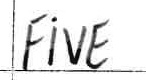

# Handwritten Words detection

This repository contain codes to classify 12 handwritten words collected by different people.

## Dataset

We collected the dataset which is publically available at : https://www.kaggle.com/nabeel965/handwritten-words-dataset

A sample image is shown below:

## Preprocessing
Following two approaches are used to preprocessing input and feature extraction:

1. Histogram of Gradients (HOG)
2. Principal Component Analysis (PCA)

## ML techniques
Following two methods are used for classification purpose:
1. K-Nearest Neighbors 
2. Artificial Neural Network

